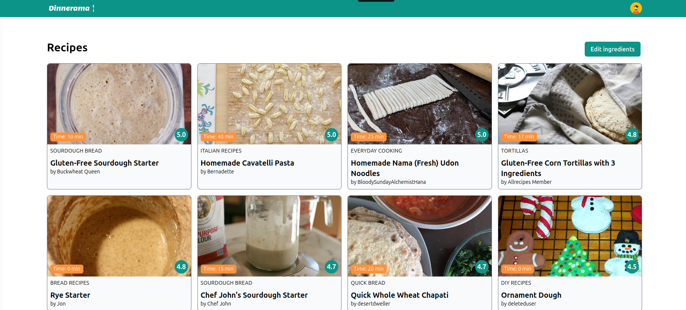

# Dinnerama

Prototype to get recipes recommended based on the user's ingredients. Built with Rails 7, React 18 and Remix 2.9.2.



## How to install

### Dependencies

Follow the instructions described on [this website](https://gorails.com/setup/ubuntu/24.04) after selecting your environment (i.e. Ubuntu 24.04).
You basically need Git, Ruby and Node preinstalled.
Also, you'll need Postgresql and configured with a user that matches the Rails DB config used in this repo.

### Project

```bash
git clone git@github.com:albertoblaz/pennylane-app.git
cd pennylane-app/backend
bundle install
cd ../frontend
npm install
```

## How to run

Open the terminal and type these commands:


```bash
cd backend
rails s
```

Then, open a second tab and run these:

```bash
cd frontend
npm run dev
```